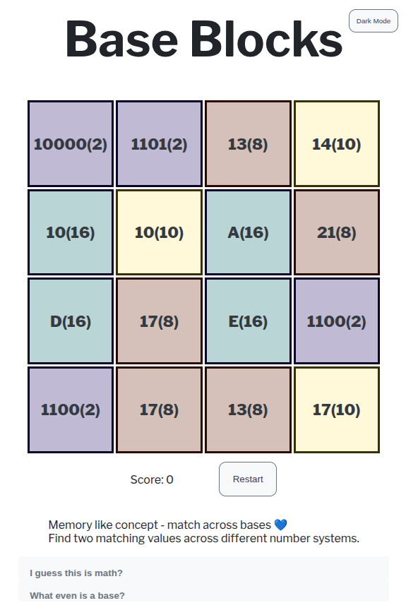

# Base Blocks Game

A memory-style game where players match numbers across different number systems.

> WIP (WORK IN PROGRESS)

[](https://base-blocks.vercel.app/)

## Features

- Match blocks with the same value in different bases (binary, decimal, hex, octal).
- Flip blocks to cycle through number systems.
- Dark/light mode toggle.

## How to Play

1. Left click a block to select it.
2. Find another block with the same value in any base.
3. Right click to flip a block and view different number bases.
4. Match all blocks to win!

## Setup

1. Visit 
    ```
   https://base-blocks.vercel.app/
    ```
2. Play. 

or: 

1. Clone this repo:
   ```bash
   git clone https://github.com/RemiSlanina/BaseBlocks
   ```
2. Open index.html in your browser.

## Future Plans

- Fix style.
- Add a timer.
- Let users select game difficulty (number of blocks, bases).
- Add Restart and Pause.
- Eat some cookies.

## License

MIT for the code:

- The **code** in this repository is licensed under the [MIT License](./LICENSE).
- The **artwork, images, and design assets** are © Remi Slanina.

You may:

- ✅ Use or adapt the **code** freely (MIT).
- ✅ Use the **artwork** for personal or educational purposes, with **credit**.
- ❌ Not use the artwork or images for **commercial purposes** without explicit permission.

This means:

- **Developers** → free to use the code in your own projects.
- **Artists/educators** → free to show or remix the visuals if you credit me.
- **Companies** → please contact me before using any artwork commercially.

---

Thank you for visiting.
